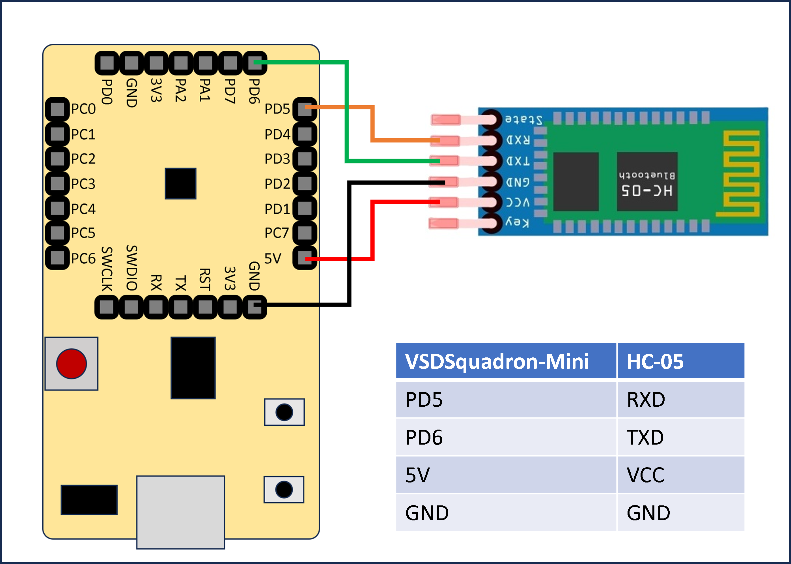
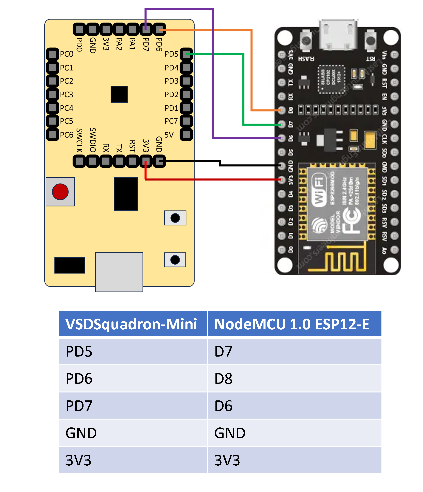

# Programming VSDSquadron-Mini using Over-The-Air(OTA) Feature

## Overview
The project focuses on programming the VSDSquadron-Mini board using Over-The-Air (OTA) feature. This means we can update the board remotely without needing to connect it physically. It's a convenient way to make changes and improvements to the board's software without hassle. This approach simplifies the process, making it easier for developers to manage and update the board's firmware from anywhere, enhancing its usability and versatility. There are two ways to implement OTA feature, as described below.

## Setup
We are going to use the following softwares and tools to program the VSDSquadron-Mini board.
* [MounRiver Studio v1.91](http://www.mounriver.com/download "MRS 1.91 Download page")
* [WCH-LinkUtility](https://www.wch.cn/downloads/WCH-LinkUtility_ZIP.html "WCH-LinkUtility Download page")

## Method I : OTA using HC-05 Bluetooth module

### Description
In this method, we are going flash the VSDSquadron-Mini board using the HC-05 Bluetooth module. Instead of programming the board over wired Serial link, we are going to use Standard Serial over Bluetooth link, which can be thought of as a portal which connects 2 devices over the air.

### Components required
* VSDSquadron-Mini board
* HC-05 Bluetooth module
* Jumper wires

### Circuit Connection

### Pinout Diagram

## Method II : OTA using ESP8266 (NodeMCU 1.0 ESP-12E) WiFi module

### Description
By default, the VSDSquadron-Mini board is configured to be programmed through Single-Wire Protocol and currespondingly WCH-LinkE is used for programming this. As it is difficult to get the timings perfectly for ESP8266 board to update the firmware over Single-wire protocol, we can flash the VSDSquadron-Mini with IAP program, which allows us to program it through UART / USART. Hence, we can upload the file to ESP8266's local server and then the ESP8266 can be configured to program the VSDSquadron-Mini through UART.

### Components required
* VSDSquadron-Mini board
* ESP8266 (NodeMCU 1.0 ESP-12E) module
* Jumper wires

### Circuit Connection

### Pinout Diagram

