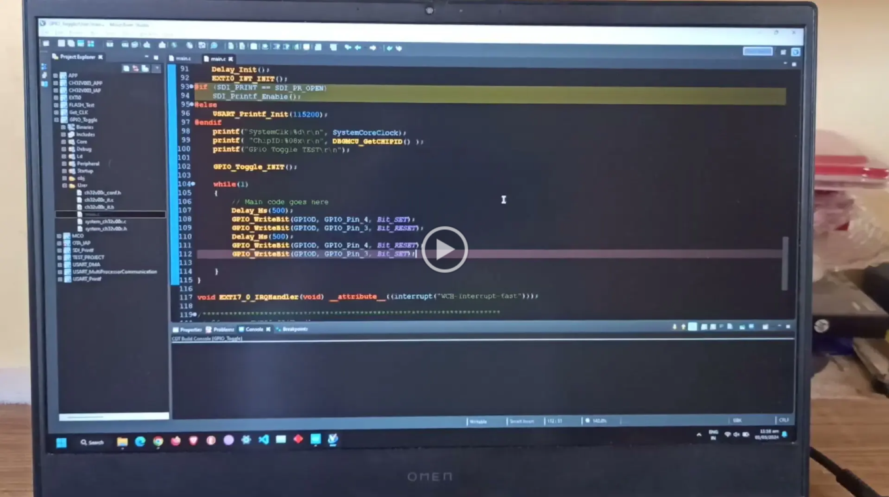
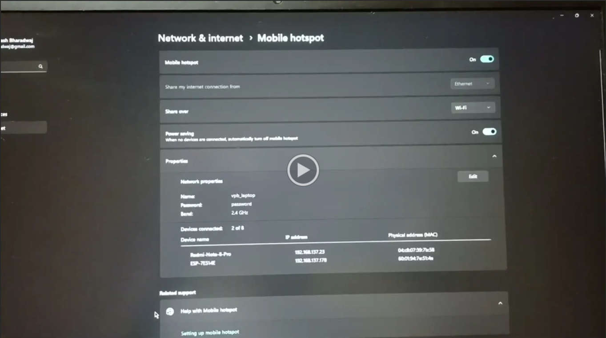

# Programming VSDSquadron-Mini using Over-The-Air(OTA) Feature

## Overview
The project focuses on programming the VSDSquadron-Mini board using Over-The-Air (OTA) feature. This means we can update the board remotely without needing to connect it physically. It's a convenient way to make changes and improvements to the board's software without hassle. This approach simplifies the process, making it easier for developers to manage and update the board's firmware from anywhere, enhancing its usability and versatility. There are two ways to implement OTA feature, as described below.

## Setup
We are going to use the following softwares and tools to program the VSDSquadron-Mini board.
* [MounRiver Studio v1.91](http://www.mounriver.com/download "MRS 1.91 Download page")
* [WCH-LinkUtility](https://www.wch.cn/downloads/WCH-LinkUtility_ZIP.html "WCH-LinkUtility Download page")
* [Arduino IDE 2.3.2](https://www.arduino.cc/en/software "Arduino IDE Download page")

## Components required
* VSDSquadron-Mini board
* ESP8266 (NodeMCU 1.0 ESP-12E) module
* Jumper wires

## Circuit Connection
In this method, the NodeMCU 1.0 ESP-12E module is connected to the VSDSquadron-Mini (VSDSM) as follows:
* The 3V3 pin of NodeMCU is connected to 3V3 of VSDSM and GND of NodeMCU is connected to GND of VSDSM. This supplies power to the NodeMCU.
* The D7 (RX2) pin of NodeMCU is connected to PD5 (TX) pin of VSDSM. This allows NodeMCU to read the data sent from VSDSM.
* The D8 (TX2) pin of NodeMCU is connected to PD6 (RX) pin of VSDSM. This allows NodeMCU to transmit the data to the VSDSM. All the commands for flashing the VSDSM will be sent through this pin.
* The D6 pin of NodeMCU is connected to PD7 (NRST) pin of VSDSM. This allows NodeMCU to reset the VSDSM and make it enter the program mode.

## Pinout Diagram

## Application Video
### Uploading the code to VSDSquadron-Mini from laptop

### Uploading the code to VSDSquadron-Mini from a Smartphone

## Fault Injection Attacks on VSDSquadron-Mini board
### What is a 'fault'?
Triggering an unexpected, incorrect execution in a system.

### What is a 'fault injection'?
Triggering an unexpected, incorrect execution by *intensionally* altering the environment.

### Types of Fault Injections:
1. **Voltage Fault Injection**: Attackers manipulate the power supply voltage to induce faults in hardware components, such as microcontrollers or memory chips, causing erroneous behavior or data corruption.
2. **Clock Glitching**: By disrupting the system clock signals, attackers can create timing violations, leading to incorrect processing or execution of instructions within the targeted device.
3. **Optical Fault Injection**: Using lasers or intense light sources, attackers target specific areas of the device to induce faults, potentially altering the behavior of integrated circuits or causing them to malfunction.
4. **Electromagnetic Fault Injection (EMFI)**: This technique involves exposing the device to electromagnetic interference, which can disrupt its normal operation by causing transient faults in sensitive components.

### Fault injection attacks could not be performed due to following reasons:
1. Voltage glitching requires desoldering of decoupling capacitors present on the VSDSquadron-Mini board.
2. Clock glitching requires desoldering crystal oscillator and its decoupling capacitors.
3. Unavailability of equipments like Oscilloscope and Logic Analyzer.
