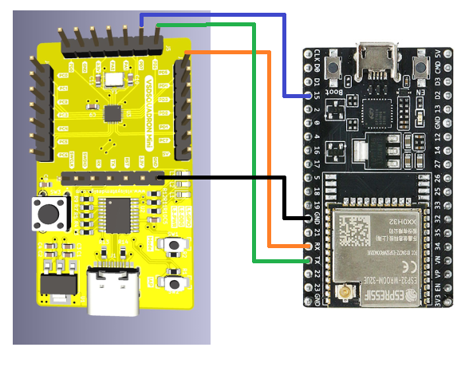

# Programming VSDSquadron-Mini via Over-The-Air(OTA) Feature

## Overview
The project focuses on programming the VSDSquadron-Mini board using Over-The-Air (OTA) feature. This means we can update the board remotely without needing to connect it physically. It's a convenient way to make changes and improvements to the board's software without hassle. This approach simplifies the process, making it easier for developers to manage and update the board's firmware from anywhere, enhancing its usability and versatility.

## Components required
* VSDSquadron-Mini board
* Espressif ESP32-WROOM-32UE WiFi Module
* Jumper wires

By default, the VSDSquadron-Mini board is configured to be programmed through Single-Wire Protocol and currespondingly WCH-LinkE is used for programming this. As it is difficult to get the timings perfectly for ESP32 board to update the firmware over Single-wire protocol, we can flash the VSDSquadron-Mini with IAP program, which allows us to program it through UART / USART. Hence, we can upload the file to ESP32's local file server and then the ESP32 can be configured to program the VSDSquadron-Mini through UART.

## Schematic Diagram

