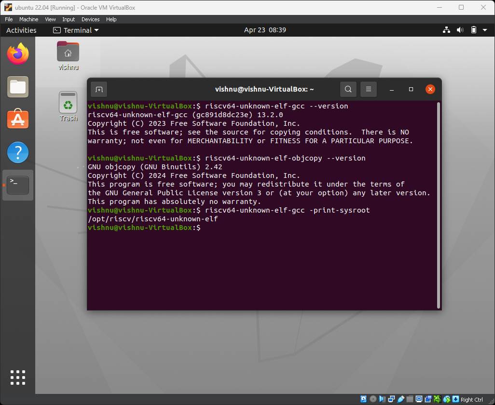
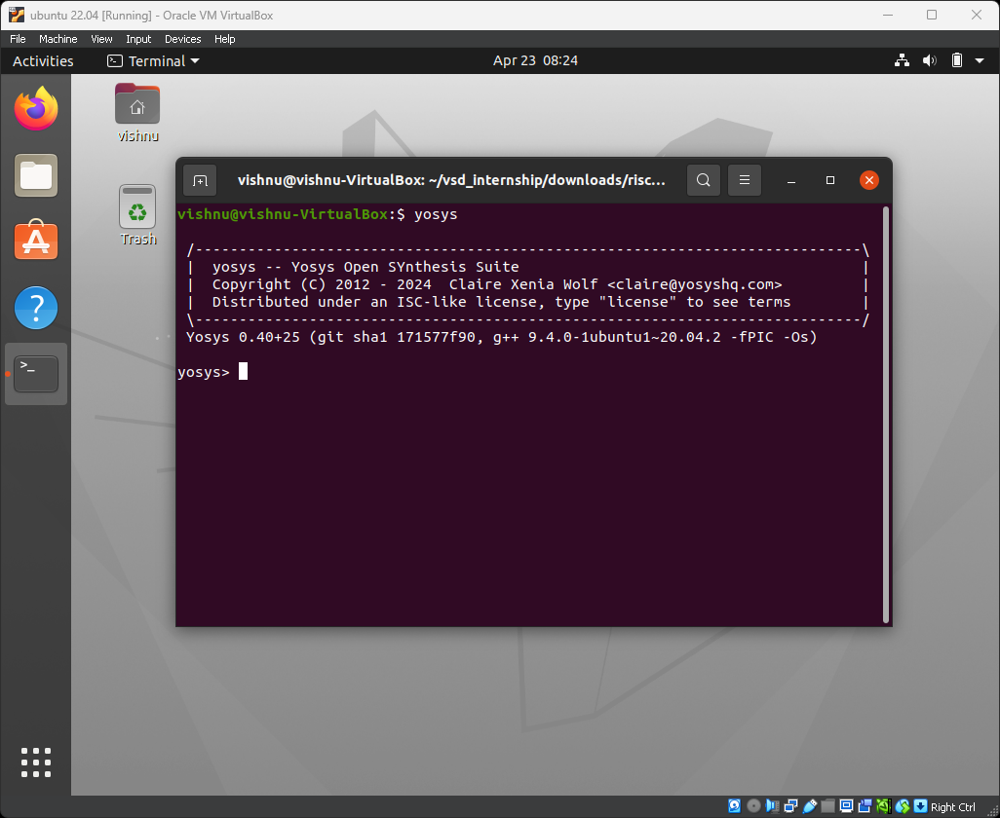
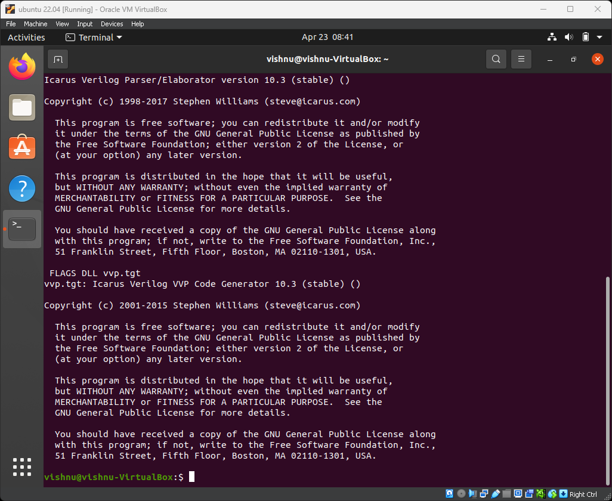
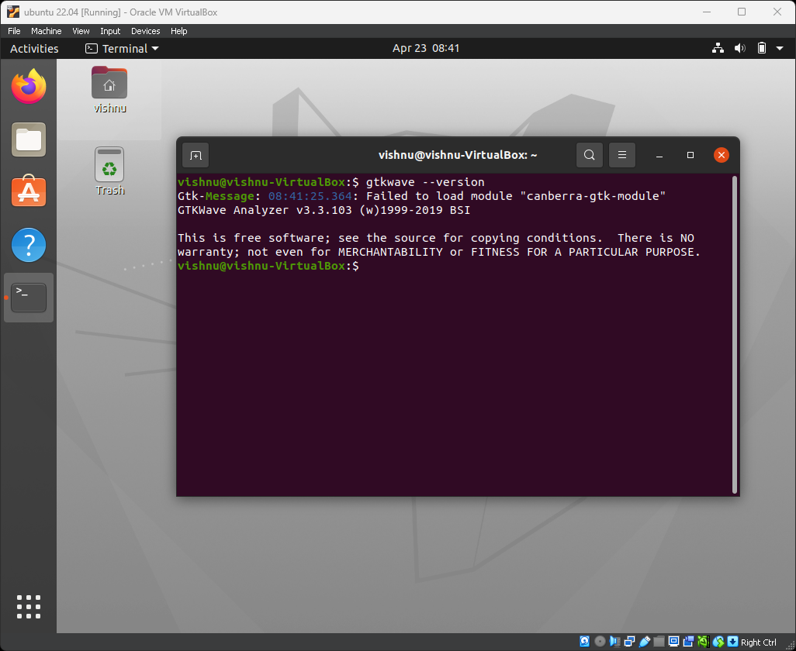
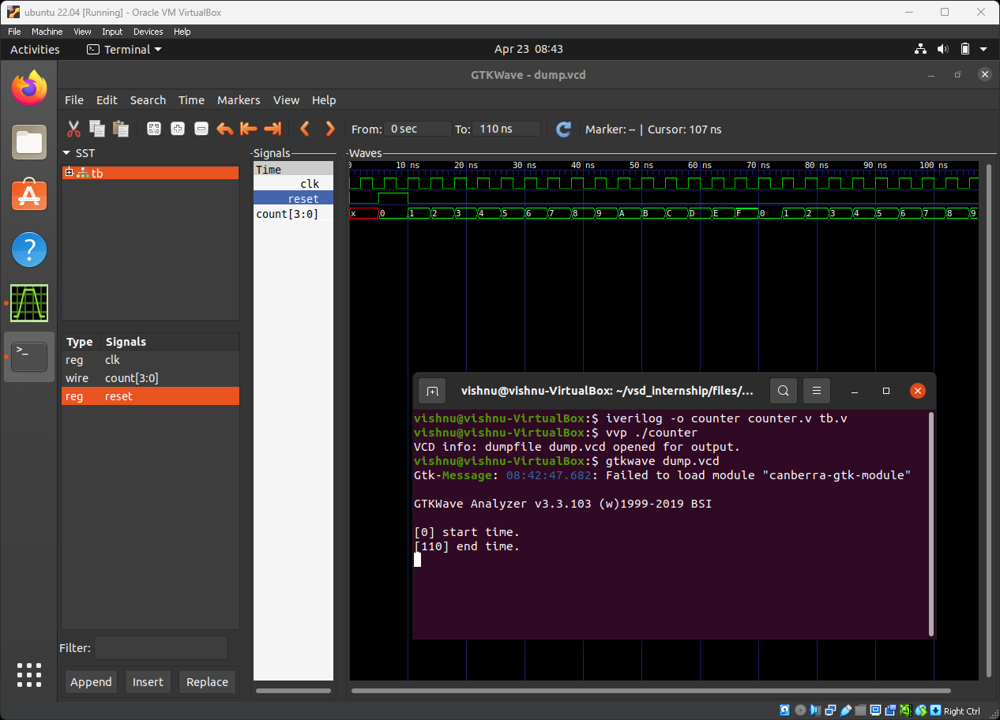

# Vsdsquadron-mini-internship
## Week-1 : Environment setup
* RISCV GNU TOOLCHAIN

* Yosys Open SYnthesis Suite

* Icarus Verilog

* GTKWave

* Testing iverilog and gtkwave with a mod 16 counter in verilog

